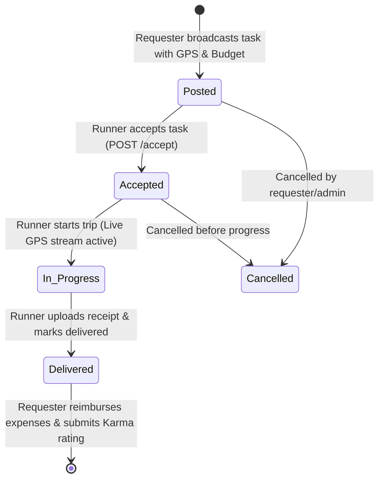

<div align="center">

# 🏃‍♂️ ChalLaa
### *Decentralized Peer-to-Peer Campus Errand & Micro-Task Network*

[](https://expo.dev)
[](https://reactnative.dev)
[](https://react.dev)
[](https://nodejs.org)
[](https://expressjs.com)
[](https://mongodb.com)
[](https://socket.io)
[](LICENSE)

<p align="center">
  <b>ChalLaa</b> transforms fragmented, chaotic WhatsApp campus groups into a structured, real-time, geofenced micro-task platform. Built specifically for hostel and university residents to broadcast, fulfill, track, and reimburse errands transparently.
</p>

[Key Features](#-key-features) • [System Architecture](#-system-architecture) • [Multi-Role Workflows](#-multi-role-workflows) • [API Reference](#-api-endpoints) • [Socket Events](#-real-time-socketio-events) • [Getting Started](#-getting-started)

---

</div>

## 📌 Problem & Vision

Campus and hostel residents frequently need small essentials (food, pharmacy, stationery, courier pick-ups, laundry) or are already walking to campus markets. 
Traditional WhatsApp groups lack:
* ❌ **Location awareness** (no geofencing or distance filters)
* ❌ **Live trip tracking** (no visibility into runner ETA)
* ❌ **Receipt verification** (disputes over bill amounts and purchased items)
* ❌ **Accountability** (no reputation, student ID verification, or dispute arbitration)

**ChalLaa** solves this with automated GPS discovery, in-app encrypted messaging, camera proof uploads, an itemized reimbursement ledger, and peer karma scoring.

---

## 🌟 Key Features

### 1. 🙋 Requester Workflow
- **📍 GPS-Geofenced Errand Broadcast**: Post errands with automatic GPS reverse-geocoding, category tags (Food, Grocery, Pharmacy, Courier, Stationery, Laundry), and budget offers.
- **🔍 Discovery Feed**: Interactive radius filter (1 km, 2 km, 5 km) with real-time active task listings.
- **🛰️ Live Runner GPS Telemetry**: Track active runners in real time with dynamic ETA and Haversine distance calculations.
- **💬 In-App Errand Chat**: Real-time communication with runner, live typing indicators, and read states.
- **🧾 Receipt & Expense Settlement**: Review itemized expense receipts and mark out-of-pocket costs as reimbursed.
- **⭐ Peer Karma Scoring**: Award 1–5 star ratings to credit runner karma and build campus trust.

### 2. 🏃 Runner Workflow
- **⚡ Instant Task Acceptance**: Discover nearby errands and claim tasks with one tap.
- **📡 Background GPS Location Streaming**: Stream real-time GPS coordinates via WebSockets during transit.
- **📸 Native Camera Receipt Capture**: Take photo proof of bills/items using `expo-camera` with `expo-image-manipulator` compression.
- **💰 Out-of-Pocket Expense Logging**: Log exact bill amounts with receipts for instant transparent reimbursement.
- **🔄 Status Lifecycle Management**: Progress tasks smoothly: `Posted` ➔ `Accepted` ➔ `In Progress` ➔ `Delivered`.

### 3. 🛡️ Campus Admin & Moderator Panel
- **📊 Real-Time Metrics & Analytics**: Platform-wide monitoring of task volume, active runners, completed trips, and finances.
- **🎓 Student ID Verification**: Verify hostel/college IDs to award trusted badges.
- **⚖️ Dispute Arbitration**: Investigate flagged issues (wrong items, reimbursement disputes, misconduct) and arbitrate resolutions.

---

## 🏗 System Architecture

```
┌─────────────────────────────────────────────────────────────────────────┐
│                        ChalLaa React Native App                         │
│                    (Expo SDK 57 / Expo Router / React 19)               │
└───────────────────▲─────────────────────────────────▲───────────────────┘
                    │ REST API (Axios + JWT)          │ WebSockets (Socket.io)
                    │                                 │
┌───────────────────▼─────────────────────────────────▼───────────────────┐
│                           Node.js Express API Server                    │
│                                (Port 5000)                              │
├─────────────────────────────────────────────────────────────────────────┤
│ • Auth Middleware (JWT Token Rotation) • Multer Image Uploads           │
│ • Geofence Controller (2dsphere Query) • Socket Rooms (`errand_{id}`)   │
│ • Karma Scoring Engine                 • Admin Moderation Engine        │
└───────────────────▲─────────────────────────────────▲───────────────────┘
                    │                                 │
┌───────────────────▼───────────────────┐ ┌───────────▼───────────────────┐
│       MongoDB Atlas / Local           │ │       Static File Server      │
│  (Users, Errands, Messages, Expenses) │ │       (`/uploads/proof-*`)    │
└───────────────────────────────────────┘ └───────────────────────────────┘
```

---

## 🔄 Multi-Role Workflows

### Errand Lifecycle State Machine



---

## 📂 Project Structure

```bash
ChalLaa/
├── backend/                        # Node.js & Express API Server
│   ├── server.js                   # Server entrypoint & Socket.io server
│   ├── uploads/                    # Proof images & receipts storage
│   └── src/
│       ├── config/                 # Database (MongoDB) & Environment config
│       ├── controllers/            # Errand, Auth, Message, Expense, Admin controllers
│       ├── middleware/             # JWT auth, Role checks, Multer uploads
│       ├── models/                 # Mongoose models (User, Errand, Transaction, Rating, Dispute)
│       ├── routes/                 # Express API routes
│       ├── sockets/                # Real-time chat & location streaming handlers
│       └── utils/                  # JWT token helpers
│
└── frontend/                       # React Native Mobile App (Expo SDK 57)
    ├── app/                        # File-based Expo Router Navigation
    │   ├── (auth)/                 # Login & Registration screens
    │   ├── (tabs)/                 # Main Bottom Tabs (Feed, My Errands, Profile)
    │   ├── errand/                 # Errand Details ([id].jsx) & Post Screen (post.jsx)
    │   └── admin/                  # Campus Moderation Panel (index.jsx)
    ├── components/                 # Reusable UI & Feature components
    │   ├── CameraModal.jsx         # Native camera capture & compression
    │   ├── ChatSection.jsx         # Real-time chat & typing indicators
    │   ├── DisputeModal.jsx        # Dispute filing modal
    │   ├── ExpenseSection.jsx      # Ledger & reimbursement settlements
    │   ├── ProofSection.jsx        # Receipt photo gallery
    │   ├── RatingModal.jsx         # 5-Star Karma evaluation
    │   └── TrackingSection.jsx     # Live GPS tracking telemetry
    ├── constants/                  # Theme tokens, colors, typography, shadows
    ├── context/                    # AuthContext (SecureStore token rotation)
    └── services/                   # Axios API client, Socket.io, Push Notifications
```

---

## 📡 API Endpoints

### Authentication (`/api/auth`)
| Method | Endpoint | Description | Auth Required |
|---|---|---|---|
| `POST` | `/api/auth/register` | Register student account | No |
| `POST` | `/api/auth/login` | Login & receive JWT tokens | No |
| `POST` | `/api/auth/refresh` | Rotate access token via refresh token | No |

### Errands (`/api/errands`)
| Method | Endpoint | Description | Auth Required |
|---|---|---|---|
| `POST` | `/api/errands` | Post new errand with coordinates | Yes |
| `GET` | `/api/errands/nearby` | Discover errands via 2dsphere radius | Yes |
| `GET` | `/api/errands/mine` | List user's requested and running tasks | Yes |
| `GET` | `/api/errands/:id` | Fetch full errand details | Yes |
| `PATCH`| `/api/errands/:id/accept` | Accept errand (become runner) | Yes |
| `PATCH`| `/api/errands/:id/status` | Update lifecycle (`in_progress`, `delivered`, `cancelled`) | Yes |
| `POST` | `/api/errands/:id/proof` | Upload receipt / delivery proof image | Yes |
| `GET`  | `/api/errands/:id/messages`| Fetch chat history for errand | Yes |
| `POST` | `/api/errands/:id/messages`| Send in-app message | Yes |

### Expenses & Ledger (`/api/expenses`)
| Method | Endpoint | Description | Auth Required |
|---|---|---|---|
| `POST` | `/api/expenses` | Log out-of-pocket purchase | Yes |
| `GET`  | `/api/expenses/errand/:id` | Fetch itemized bill ledger & totals | Yes |
| `PATCH`| `/api/expenses/:id/settle` | Mark expense as reimbursed | Yes |

### Karma & Moderation (`/api/karma` & `/api/admin`)
| Method | Endpoint | Description | Auth Required |
|---|---|---|---|
| `POST` | `/api/karma/rate` | Submit peer rating & karma update | Yes |
| `POST` | `/api/karma/dispute` | File dispute report to moderators | Yes |
| `GET`  | `/api/admin/stats` | Aggregate campus analytics | Admin |
| `GET`  | `/api/admin/users` | List students with filter & search | Admin |
| `PATCH`| `/api/admin/users/:id/verify`| Toggle student verification badge | Admin |
| `PATCH`| `/api/admin/disputes/:id/resolve`| Resolve open dispute | Admin |

---

## ⚡ Real-Time Socket.io Events

| Event Name | Direction | Payload | Description |
|---|---|---|---|
| `join_errand_room` | Client ➔ Server | `{ errandId, userId }` | Joins private errand room |
| `send_message` | Client ➔ Server | `{ errandId, senderId, text }` | Broadcasts message to room |
| `receive_message` | Server ➔ Client | `{ _id, errandId, senderId, text }` | Receives new message |
| `typing_start` | Client ➔ Server | `{ errandId, userName }` | Emits peer typing indicator |
| `location_update` | Runner ➔ Server | `{ errandId, lat, lng, speed }` | Streams live GPS coordinates |
| `location_broadcast`| Server ➔ Requester | `{ errandId, lat, lng, speed }` | Pushes live runner location |

---

## 🚀 Getting Started

### Prerequisites
- [Node.js](https://nodejs.org) (v18 or higher)
- [MongoDB](https://www.mongodb.com) (Running locally on `mongodb://localhost:27017` or MongoDB Atlas URI)
- [Expo Go App](https://expo.dev/go) installed on iOS / Android device

---

### 1. Backend Setup

```powershell
# Navigate to backend directory
cd backend

# Install dependencies
npm install

# Configure environment variables (create .env file)
# PORT=5000
# MONGO_URI=mongodb://127.0.0.1:27017/challaa
# JWT_ACCESS_SECRET=your_jwt_access_secret_key_here
# JWT_REFRESH_SECRET=your_jwt_refresh_secret_key_here

# Start development server
npm run dev
```
*Backend API will run on `http://localhost:5000`.*

---

### 2. Frontend Setup (Expo Mobile App)

```powershell
# Navigate to frontend directory
cd frontend

# Install SDK 57 dependencies
npm install

# Start Metro Bundler
npx expo start
```
*Scan the generated QR code in the terminal using the **Expo Go** app on your physical device or press `a` for Android Emulator.*

---

## 🎨 Design System & Palette

| Token | Color Code | Role |
|---|---|---|
| **Electric Indigo** | `#6366F1` | Primary brand color & actions |
| **Deep Violet** | `#4F46E5` | Active states & hero header gradients |
| **Emerald Green** | `#10B981` | Success states, reimbursement chips, verified badges |
| **Sunburst Amber** | `#F59E0B` | Karma stars & active errand indicators |
| **Slate Dark** | `#0F172A` | Background & dark mode elements |
| **Card Surface** | `#FFFFFF` | Elevated modern glassmorphism cards |

---

## 📄 License
This project is licensed under the [MIT License](LICENSE).

<div align="center">
  <sub>Built with ❤️ for campus communities by Priyank Khatri</sub>
</div>